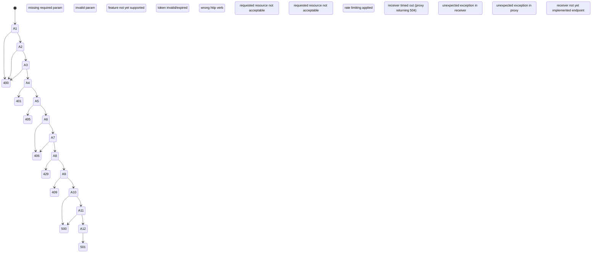
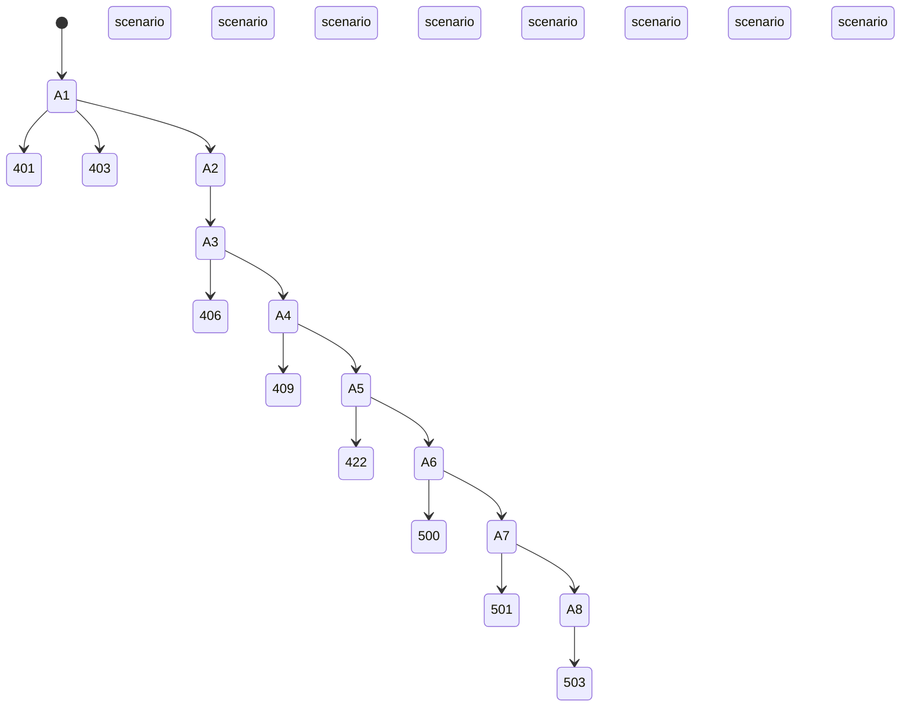
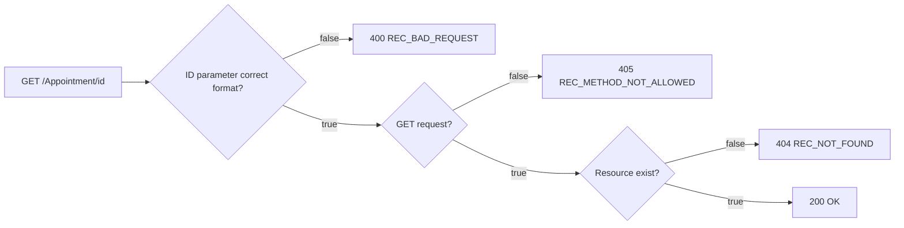
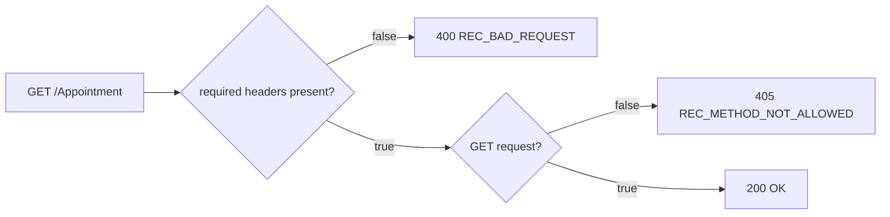
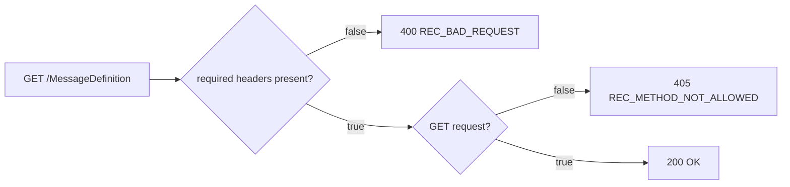
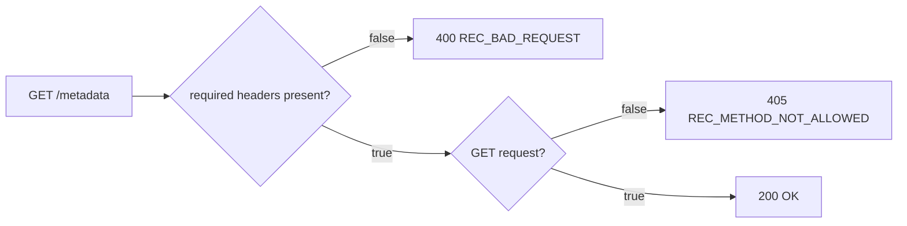
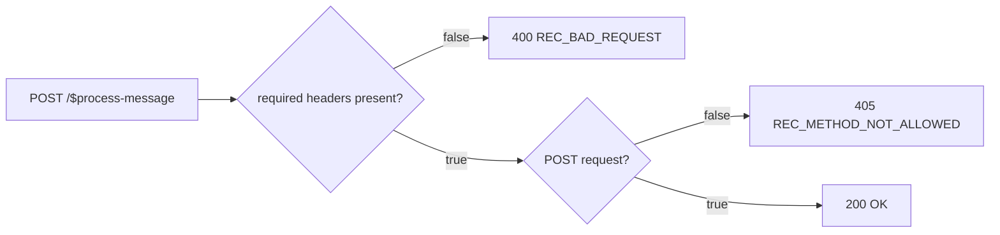
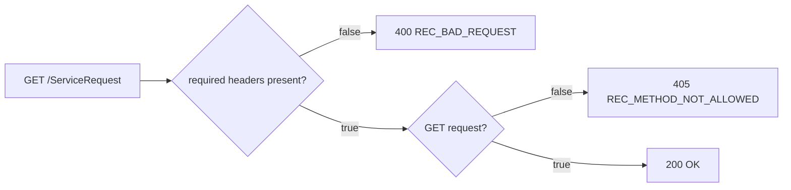
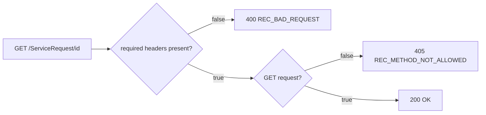
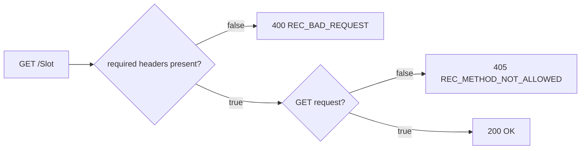

## General errors

```mermaid
stateDiagram-v2
    [*] --> A1
    A1 --> A2
    A2 --> A3
    A3 --> A4
    A4 --> A5
    A5 --> A6
    A6 --> A7
    A7 --> A8
    A8 --> A9
    A9 --> A10
    A10 --> A11
    A11 --> A12

    A1 --> 400 SEND_BAD_REQUEST: missing required param
    A2 --> 400 REC_BAD_REQUEST: invalid param
    A3 --> 400 REC_BAD_REQUEST2: feature not yet supported
    A4 --> 401 SEND_UNAUTHORIZED: token invalid/expired
    A5 --> 405 SEND_METHOD_NOT_ALLOWED: wrong http verb
    A6 --> 406 SEND_NOT_ACCEPTABLE: requested resource not acceptable
    A7 --> 406 REC_NOT_ACCEPTABLE: requested resource not acceptable
    A8 --> 429 SEND_TOO_MANY_REQUESTS: rate limiting applied
    A9 --> 409 REC_TIMEOUT: receiver timed out (proxy returning 504)
    A10 --> 500 REC_SERVER_ERROR: unexpected exception in receiver 
    A11 --> 500 PROXY_SERVER_ERROR/SERVER_ERROR : unexpected exception in proxy
    A12 --> 501 REC_NOT_IMPLEMENTED: receiver not yet implemented endpoint
```

## General errors implemented so far

```mermaid
stateDiagram-v2
    [*] --> A1
    A1 --> A2
    A2 --> A3
    A3 --> A4
    A4 --> A5
    A5 --> A6
    A6 --> A7
    A7 --> A8


    A1 --> 401 REC_UNAUTHORIZED: scenario
    A1 --> 403 REC_FORBIDDEN: scenario
    A3 --> 406 SEND_NOT_ACCEPTABLE: scenario
    A4 --> 409 REC_TIMEOUT: scenario
    A5 --> 422 REC_UNPROCESSABLE_ENTITY: scenario
    A6 --> 500 REC_SERVER_ERROR: scenario
    A7 --> 501 REC_NOT_IMPLEMENTED : scenario
    A8 --> 503 REC_SERVICE_UNAVAILABLE: scenario
```

## Endpoint specific errors

```mermaid
graph LR
    A[GET /Appointment/id] -->B{ID parameter correct format?}
    B --> |false| C[400 REC_BAD_REQUEST]
    B --> |true| D{GET request?}
    D --> |false| E[405 REC_METHOD_NOT_ALLOWED]
    D --> |true| F{Resource exist?}
    F --> |false| G[404 REC_NOT_FOUND]
    F --> |true| H[200 OK]
```

```mermaid
graph LR
    A[GET /Appointment] -->B{required headers present?}
    B --> |false| C[400 REC_BAD_REQUEST]
    B --> |true| D{GET request?}
    D --> |false| E[405 REC_METHOD_NOT_ALLOWED]
    D --> |true| F[200 OK]
```

```mermaid
graph LR
    A[GET /MessageDefinition] -->B{required headers present?}
    B --> |false| C[400 REC_BAD_REQUEST]
    B --> |true| D{GET request?}
    D --> |false| E[405 REC_METHOD_NOT_ALLOWED]
    D --> |true| F[200 OK]
```

```mermaid
graph LR
    A[GET /metadata] -->B{required headers present?}
    B --> |false| C[400 REC_BAD_REQUEST]
    B --> |true| D{GET request?}
    D --> |false| E[405 REC_METHOD_NOT_ALLOWED]
    D --> |true| F[200 OK]
```

```mermaid
graph LR
    A[POST /$process-message] -->B{required headers present?}
    B --> |false| C[400 REC_BAD_REQUEST]
    B --> |true| D{POST request?}
    D --> |false| E[405 REC_METHOD_NOT_ALLOWED]
    D --> |true| F[200 OK]
```

```mermaid
graph LR
    A[GET /ServiceRequest] -->B{required headers present?}
    B --> |false| C[400 REC_BAD_REQUEST]
    B --> |true| D{GET request?}
    D --> |false| E[405 REC_METHOD_NOT_ALLOWED]
    D --> |true| F[200 OK]
```

```mermaid
graph LR
    A[GET /ServiceRequest/id] -->B{required headers present?}
    B --> |false| C[400 REC_BAD_REQUEST]
    B --> |true| D{GET request?}
    D --> |false| E[405 REC_METHOD_NOT_ALLOWED]
    D --> |true| F[200 OK]
```

```mermaid
graph LR
    A[GET /Slot] -->B{required headers present?}
    B --> |false| C[400 REC_BAD_REQUEST]
    B --> |true| D{GET request?}
    D --> |false| E[405 REC_METHOD_NOT_ALLOWED]
    D --> |true| F[200 OK]
```