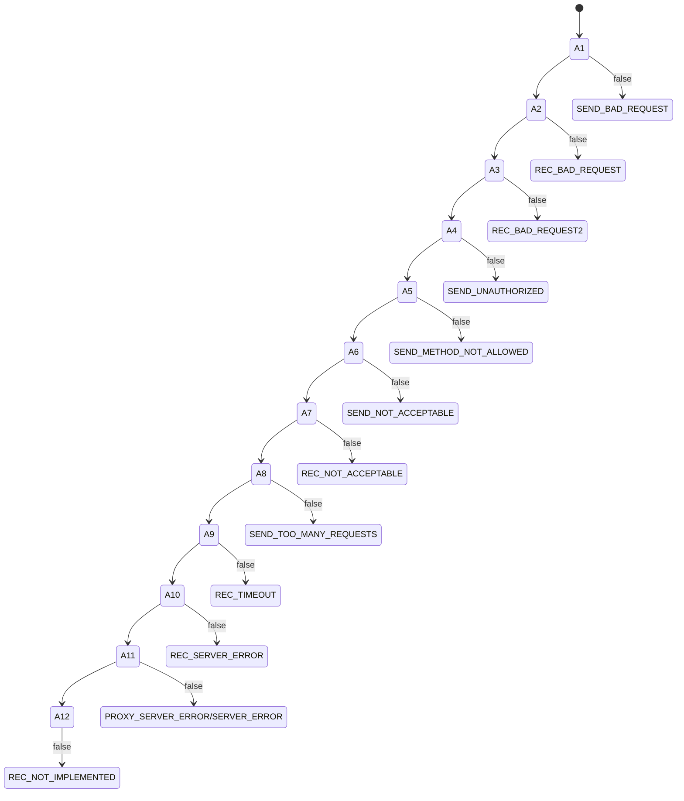
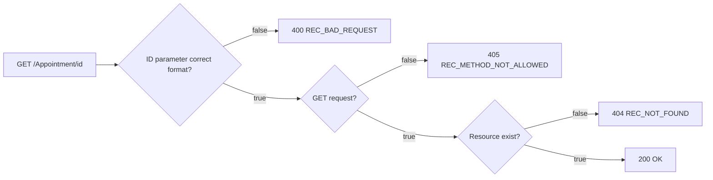
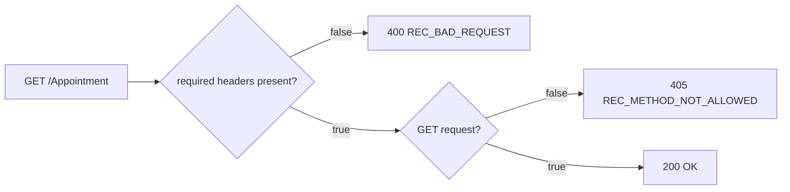
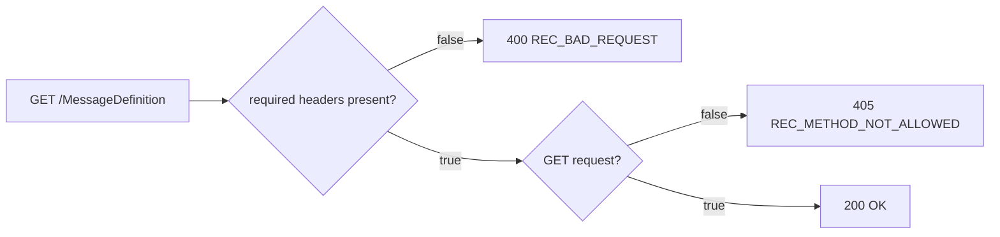
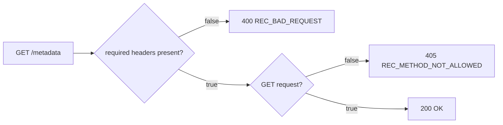
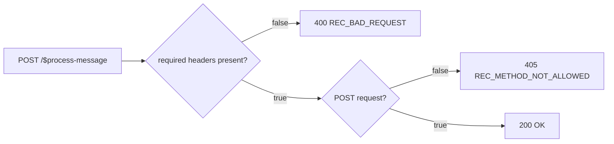
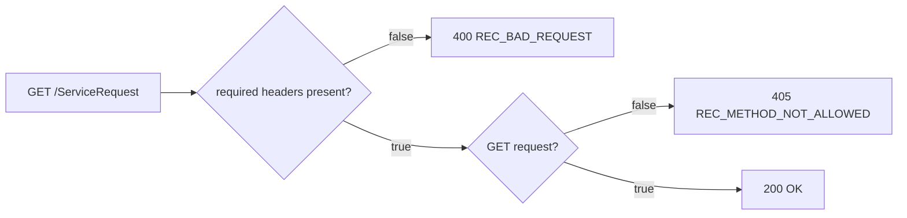
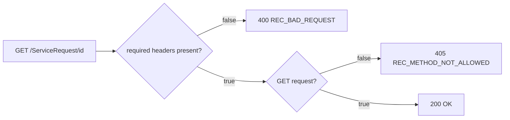
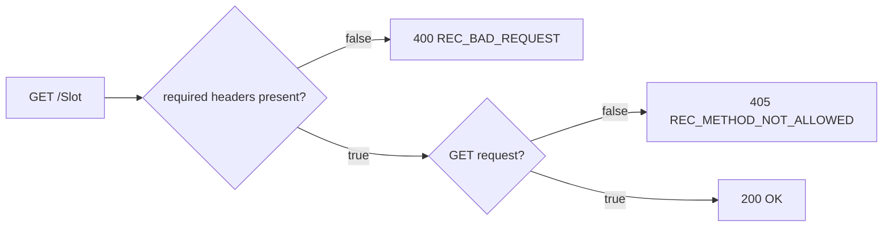

## General errors

```mermaid
stateDiagram-v2
    [*] --> A1
    A1 --> A2
    A2 --> A3
    A3 --> A4
    A4 --> A5
    A5 --> A6
    A6 --> A7
    A7 --> A8
    A8 --> A9
    A9 --> A10
    A10 --> A11
    A11 --> A12

    A1 --> SEND_BAD_REQUEST: false
    A2 --> REC_BAD_REQUEST: false
    A3 --> REC_BAD_REQUEST2: false
    A4 --> SEND_UNAUTHORIZED: false
    A5 --> SEND_METHOD_NOT_ALLOWED: false
    A6 --> SEND_NOT_ACCEPTABLE: false
    A7 --> REC_NOT_ACCEPTABLE: false
    A8 --> SEND_TOO_MANY_REQUESTS: false
    A9 --> REC_TIMEOUT: false
    A10 --> REC_SERVER_ERROR: false
    A11 --> PROXY_SERVER_ERROR/SERVER_ERROR : false
    A12 --> REC_NOT_IMPLEMENTED: false
```

## Endpoint specific errors

```mermaid
graph LR
    A[GET /Appointment/id] -->B{ID parameter correct format?}
    B --> |false| C[400 REC_BAD_REQUEST]
    B --> |true| D{GET request?}
    D --> |false| E[405 REC_METHOD_NOT_ALLOWED]
    D --> |true| F{Resource exist?}
    F --> |false| G[404 REC_NOT_FOUND]
    F --> |true| H[200 OK]
```

```mermaid
graph LR
    A[GET /Appointment] -->B{required headers present?}
    B --> |false| C[400 REC_BAD_REQUEST]
    B --> |true| D{GET request?}
    D --> |false| E[405 REC_METHOD_NOT_ALLOWED]
    D --> |true| F[200 OK]
```

```mermaid
graph LR
    A[GET /MessageDefinition] -->B{required headers present?}
    B --> |false| C[400 REC_BAD_REQUEST]
    B --> |true| D{GET request?}
    D --> |false| E[405 REC_METHOD_NOT_ALLOWED]
    D --> |true| F[200 OK]
```

```mermaid
graph LR
    A[GET /metadata] -->B{required headers present?}
    B --> |false| C[400 REC_BAD_REQUEST]
    B --> |true| D{GET request?}
    D --> |false| E[405 REC_METHOD_NOT_ALLOWED]
    D --> |true| F[200 OK]
```

```mermaid
graph LR
    A[POST /$process-message] -->B{required headers present?}
    B --> |false| C[400 REC_BAD_REQUEST]
    B --> |true| D{POST request?}
    D --> |false| E[405 REC_METHOD_NOT_ALLOWED]
    D --> |true| F[200 OK]
```

```mermaid
graph LR
    A[GET /ServiceRequest] -->B{required headers present?}
    B --> |false| C[400 REC_BAD_REQUEST]
    B --> |true| D{GET request?}
    D --> |false| E[405 REC_METHOD_NOT_ALLOWED]
    D --> |true| F[200 OK]
```

```mermaid
graph LR
    A[GET /ServiceRequest/id] -->B{required headers present?}
    B --> |false| C[400 REC_BAD_REQUEST]
    B --> |true| D{GET request?}
    D --> |false| E[405 REC_METHOD_NOT_ALLOWED]
    D --> |true| F[200 OK]
```

```mermaid
graph LR
    A[GET /Slot] -->B{required headers present?}
    B --> |false| C[400 REC_BAD_REQUEST]
    B --> |true| D{GET request?}
    D --> |false| E[405 REC_METHOD_NOT_ALLOWED]
    D --> |true| F[200 OK]
```