## General errors

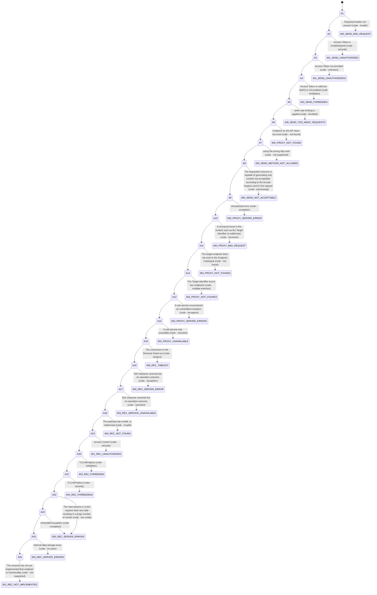

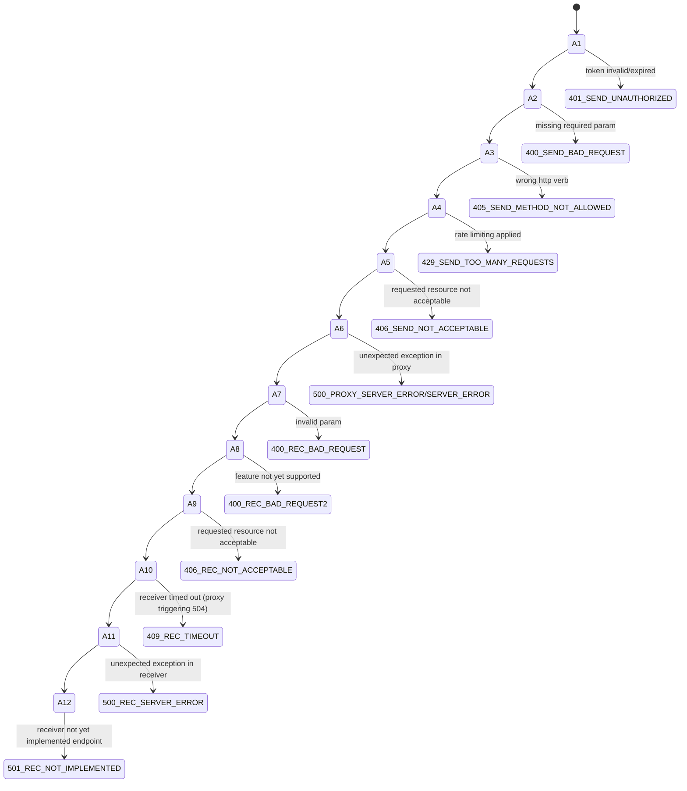

## General errors implemented so far

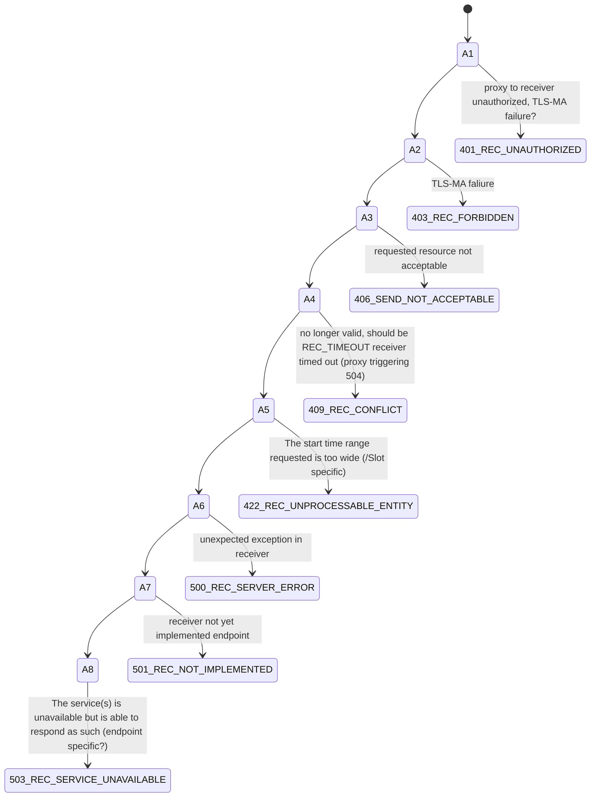

## Endpoint specific errors

### /Appointment/{id}
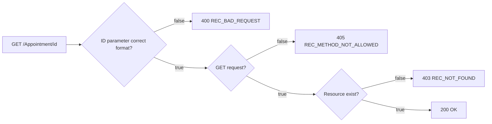
### /Appointment
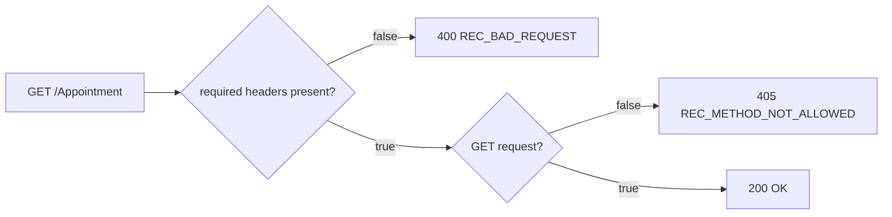
### /MessageDefinition
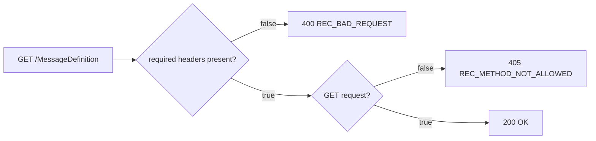
### /metadata
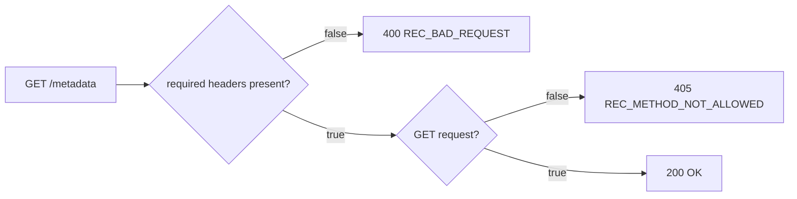
### /$process-message
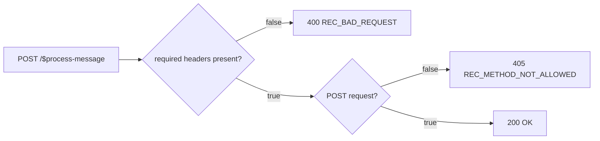
### /ServiceRequest
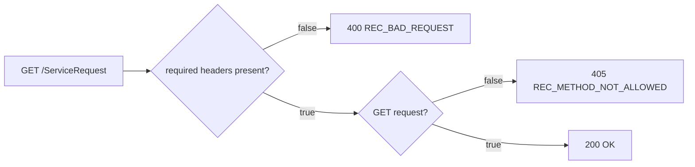
### /ServiceRequest/{id}
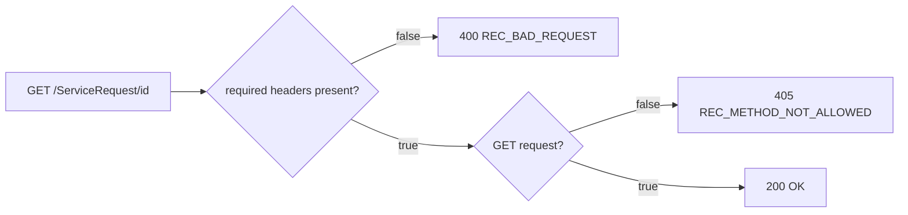
### /Slot
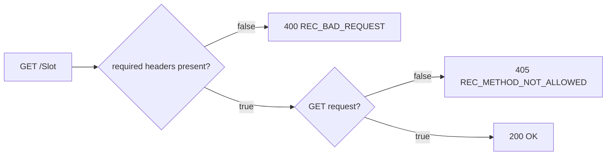